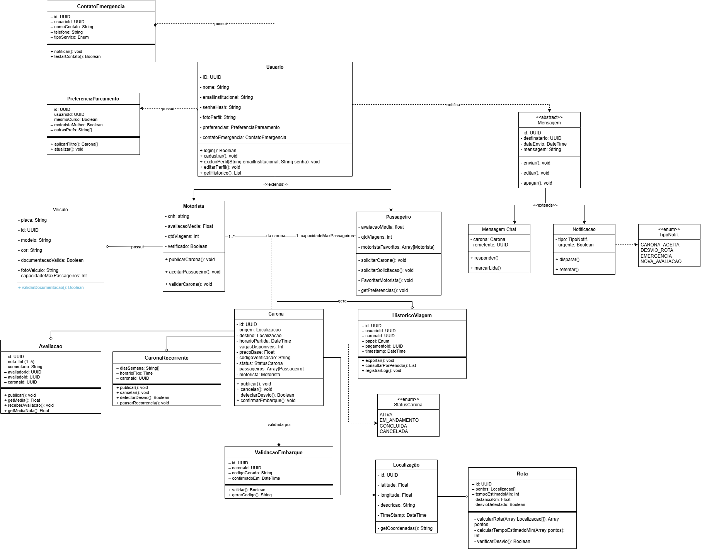

# Diagrama de Classes

## Introdução
De acordo com o artigo da plataforma UML Diagrams [[1]](#ref1), o diagrama de classes é um diagrama estrutural da UML que descreve a organização do sistema a partir de **classes** e **interfaces**, evidenciando seus elementos (atributos e operações) e os **relacionamentos** entre eles — como associações, generalizações e dependências.

## Tipos Comuns de Diagramas de Classes

* **Diagrama de modelo de domínio:** foca nos conceitos e regras de negócio.
* **Diagrama de classes de implementação:** foca nos detalhes técnicos e na codificação.

No projeto **Carona Amiga**, um web app para conectar motoristas e passageiros, o diagrama de classes será usado para modelar os principais elementos do sistema, como usuários, caronas, veículos, etc., e suas interações com fim de organizar e compreender a estrutura do sistema (modelo de domínio). 

## Objetivos

Este artefato tem como finalidade apresentar, de forma clara e estruturada, os principais elementos do sistema Carona Amiga, suas características e relações, apoiando a comunicação do time e servindo de guia para o desenvolvimento.
Este artefato tem como finalidade apresentar, de forma clara e estruturada, os principais elementos do sistema Carona Amiga, suas características e relações, apoiando a comunicação do time e servindo de guia para o desenvolvimento.
As metas principais são:

- Apresentar o Diagrama de Classes do web app Carona Amiga, evidenciando classes, atributos, operações e relacionamentos principais;

- Registrar a arquitetura lógica do sistema;

- Apoiar o desenvolvimento e a manutenção do sistema ao longo do projeto;

- Servir de referência para checagem/validação dos requisitos elicitados;

---

## Metodologia

1.    O **Diagrama de Classes** será desenvolvido utilizando a ferramenta [Draw.io](https://app.diagrams.net/), a qual permite a criação de diagramas UML de forma prática e visual.

2. Para levantar e justificar as classes do sistema, serão usadas as informações já consolidadas na [Entrega 01 do projeto](https://unbarqdsw2026-1-turma02.github.io/2026.1-T02-G7_CaronaAmigaFCTE_Entrega_01/#/), incluindo:

- **Requisitos Funcionais:** para identificar as funcionalidades que o sistema deve oferecer e, consequentemente, as classes necessárias para implementá-las. [Requisitos funcionais](../Modelagem/2.5.IniciativasExtras/RequisitosElicitados.md);

- **Requisitos Não Funcionais:** para considerar aspectos como desempenho, segurança, usabilidade, etc., que podem influenciar a estrutura do sistema e as classes envolvidas.
[Requisitos não funcionais](../Modelagem/2.5.IniciativasExtras/RequisitosElicitados.md);

Informações adicionais, como [5W2H](https://unbarqdsw2026-1-turma02.github.io/2026.1-T02-G7_CaronaAmigaFCTE_Entrega_01/#/Base/2-Artefato-Generalista/5w2h), [Brainstorming](https://unbarqdsw2026-1-turma02.github.io/2026.1-T02-G7_CaronaAmigaFCTE_Entrega_01/#/Base/2-Artefato-Generalista/Brainstorm), [Benchmarking](https://unbarqdsw2026-1-turma02.github.io/2026.1-T02-G7_CaronaAmigaFCTE_Entrega_01/#/Base/2-Artefato-Generalista/Benchmarking) e [Perfil de Usuário](https://unbarqdsw2026-1-turma02.github.io/2026.1-T02-G7_CaronaAmigaFCTE_Entrega_01/#/Base/5-Iniciativas-Extras/PerfilUsuario), também serão consideradas para garantir que o diagrama de classes reflita adequadamente as necessidades do sistema.

- **Atores do sistema:** [Atores do sistema identificados no Rich Picture](https://unbarqdsw2026-1-turma02.github.io/2026.1-T02-G7_CaronaAmigaFCTE_Entrega_01/#/Base/2-Artefato-Generalista/1.3.RichPicture);

3. A partir dessas fontes, as classes serão descritas com seus atributos e operações, e em seguida serão identificados os relacionamentos relevantes entre elas.

4. Por fim, o diagrama será produzido e revisado com base na [tabela de verificação](../2.6.VerificacaoDosDiagramas/VerificacaoDosDiagramas.md), seguindo critérios sintáticos e semânticos da UML.

Obs.: a organização do texto e das tabelas foi inspirada em artefatos de turmas anteriores [[4]](#ref4).

---

## Composição — Notação UML

Tabela 1: Legenda do Diagrama de Classes

| Elemento | Composição | Descrição |
|---|---|---|
| **Classe** |  | Representa um modelo ou tipo de objeto. |
| **Atributo** |  | Características ou propriedades de uma classe. |
| **Método** |  | Funções ou comportamentos que a classe pode executar. |
| **Associação** | `──────────────` | Relacionamento entre duas ou mais classes. |
| **Herança** | `──────────────►` | Relação onde uma classe herda atributos e métodos de outra. |
| **Agregação** | `──────────────◇` | Relacionamento onde uma classe contém outra, mas a parte existe sem o todo. |
| **Composição** | `──────────────◆` | Relacionamento mais forte onde uma classe contém outra de forma dependente, parte não existe sem o todo. |
| **Dependência** | `- - - - - - - ►` | Indica que uma classe usa outra, mas não a possui. |
| **Visibilidade** |`┌──────────────┐` `│  Classname   │` `├──────────────┤` `│+ field: type │` `├──────────────┤` `│- method(): type│` `└──────────────┘`  | Define o acesso aos membros de uma classe (público, privado, protegido). |
| **Pacote** | `┌─Package──────┐` `│Packaged elem1│` `└──────────────┘` | Agrupa classes relacionadas. |

Fonte: [João Marcos Moraes de Andrade](https://github.com/JJOAOMARCOSS),  [Luiza da Silva Pugas](https://github.com/luizaxx) e [Wanjo Christopher Paraizo Escobar](https://github.com/wChrstphr), 2026.

---

## Tipos de Relacionamento 

Para embasar a escolha dos relacionamentos que aparecem no diagrama, foi consultado o artigo [Class Diagram | Unified Modeling Language (UML)](https://www.geeksforgeeks.org/unified-modeling-language-uml-class-diagrams/) [2](#ref2). Cada tipo de relacionamento (por exemplo, associação, agregação e generalização) indica um significado específico e diferentes níveis de acoplamento entre as classes do **Carona Amiga**.

Tabela 2: Tipos de Relacionamentos

| Tipo de Relacionamento | O que é | Símbolo | Observação/Extra |
|:-----------------------|:--------|:--------|:-----------------|
| Dependência | Indica que uma classe utiliza outra de forma pontual, sem criar um vínculo permanente entre elas. | Linha tracejada com seta. | Não será representado no diagrama para manter a legibilidade. |
| Associação | Estabelece uma conexão entre classes onde uma delas tem conhecimento da outra e pode interagir com ela. | Linha contínua simples. | - |
| Agregação | Modela uma relação de "parte-todo" flexível, onde as partes continuam existindo mesmo sem o objeto principal. | Linha contínua com losango branco no "todo". | - |
| Composição | Modela uma relação de "parte-todo" rígida, onde as partes dependem totalmente do objeto principal para existir. | Linha contínua com losango preto no "todo". | - |
| Generalização | Expressa uma relação de herança entre classes, onde a subclasse absorve características e comportamentos da superclasse. | Linha contínua com seta aberta (vazia) para a superclasse. | - |
| Realização | Indica que uma classe concreta cumpre o contrato definido por uma interface, implementando todos os seus comportamentos. | Linha tracejada com seta aberta (vazia) para a interface. | - |

Fonte: [João Marcos Moraes de Andrade](https://github.com/JJOAOMARCOSS),  [Luiza da Silva Pugas](https://github.com/luizaxx) e [Wanjo Christopher Paraizo Escobar](https://github.com/wChrstphr), 2026.

---

## Conceitos Importantes

### Superclasse

- **Definição**: Uma superclasse é uma classe mais geral que concentra características e comportamentos compartilhados por outras classes.
- **Exemplo**: A classe **Conteúdo** pode ser a superclasse de **Artigo** e **Vídeo**, pois ambos compartilham características como `título`, `descrição` e `Data de publicação`.

### Subclasse

- **Definição**: Uma subclasse especializa a superclasse, herdando seus elementos e podendo acrescentar atributos e comportamentos próprios.
- **Exemplo**: **Artigo** seria uma subclasse de **Conteúdo**.

## Os Relacionamentos no Diagrama de Classes

Tabela 3: Cardinalidades

| Cardinalidade | Uso (multiplicidade) | Significado |
|---|---|---|
| `1` | `1..1` | Uma instância se relaciona com exatamente uma instância. |
| `*` | `*..1` | Muitas instâncias se relacionam com, no máximo, uma instância. |
| `1..1` | `*..1` | Muitas instâncias se relacionam com exatamente uma instância. |

Fonte: Elaborado pelos autores, com base na Aula de Modelagem UML Estática [3](#ref3). 
Autores: [João Marcos Moraes de Andrade](https://github.com/JJOAOMARCOSS), [Luiza da Silva Pugas](https://github.com/luizaxx) e [Wanjo Christopher Paraizo Escobar](https://github.com/wChrstphr), 2026.

---

## Diagrama de Classes

              Figura 1: Diagrama de Classes.

Fonte: [João Marcos Moraes de Andrade](https://github.com/JJOAOMARCOSS),  [Luiza da Silva Pugas](https://github.com/luizaxx) e [Wanjo Christopher Paraizo Escobar](https://github.com/wChrstphr), 2026.

## Conclusão

A elaboração do Diagrama de Classes do projeto **Carona Amiga** permitiu representar, de forma estruturada, as principais entidades do sistema, seus atributos e relacionamentos. O artefato contribui para o alinhamento e a comunicação entre a equipe, além de servir como apoio à validação dos requisitos e à implementação. Dessa forma, o diagrama também se torna uma referência para evolução e manutenção do sistema ao longo do projeto.

---

## Referências Bibliográficas

> 1. UML Diagrams. *Class Diagrams Overview*. Disponível em: https://www.uml-diagrams.org/class-diagrams-overview.html. Acesso em: 19 abr. 2026.
>
> 2. GeeksforGeeks. *Class Diagram | Unified Modeling Language (UML)*. Disponível em: https://www.geeksforgeeks.org/unified-modeling-language-uml-class-diagrams/. Acesso em: 19 abr. 2026.
>
> 3. Aula Modelagem UML Estática. Material de aula. 2026.
>
> 4. UnBArqDsw2025-1-Turma02. *Galáxia Conectada — Diagrama de Classes* (autoria: Larissa Stéfane). Disponível em: https://unbarqdsw2025-1-turma02.github.io/2025.1_T02_G9_GalaxiaConectada_Entrega02/#/Modelagem/ModelagemEstatica/DiagramaClasses. Acesso em: 19 abr. 2026.

## Histórico de Versões

| Versão | Data | Descrição | Autor(es) | Revisor(es) | Detalhes da revisão |
| :----: | :--: | --------- | ----------- | ------ | :---: |
| 1.0  | 09/04/2026 | Criação do documento | [Luiza da Silva Pugas](https://github.com/luizaxx) e [João Marcos Moraes de Andrade](https://github.com/JJOAOMARCOSS) | [Wanjo Christopher Paraizo Escobar](https://github.com/wChrstphr) | Artefato revisado |
| 1.1  | 15/04/2026 | Adicionando img do diagrama | [Wanjo Christopher Paraizo Escobar](https://github.com/wChrstphr) | [Luiza da Silva Pugas](https://github.com/luizaxx) e [João Marcos Moraes de Andrade](https://github.com/JJOAOMARCOSS) | Artefato revisado |
| 1.2 | 15/04/2026 | Ajustando diagrama (WIP) | [Wanjo Christopher Paraizo Escobar](https://github.com/wChrstphr) | [Luiza da Silva Pugas](https://github.com/luizaxx) e [João Marcos Moraes de Andrade](https://github.com/JJOAOMARCOSS) | Artefato revisado |
| 1.3 | 16/04/2026 | Conclusão do diagrama de classes | [Wanjo Christopher Paraizo Escobar](https://github.com/wChrstphr), [Luiza da Silva Pugas](https://github.com/luizaxx) e [João Marcos Moraes de Andrade](https://github.com/JJOAOMARCOSS) | [Karoline Luz da Conceição](https://github.com/KarolineLuz) | Artefato revisado |