# Diagrama de Comunicação

## Introdução
O Diagrama de Comunicação (também conhecido como Diagrama de Colaboração no UML 1.x) é um artefato de modelagem dinâmica que descreve como participantes de um cenário (objetos/instâncias) se relacionam e trocam mensagens para realizar uma funcionalidade. Diferente de um diagrama de sequência, seu foco é destacar a estrutura da colaboração (vínculos) e a numeração das mensagens, facilitando a leitura do “quem fala com quem” no fluxo. [[1]](#ref1)

Neste artefato, os principais elementos da notação utilizados são: _frame_, _lifeline_ e _message_, conforme discutido em aula. [[2]](#ref2)

## Objetivos

Este artefato tem como objetivo representar, de forma estruturada, as principais comunicações entre participantes do sistema **Carona Amiga**, contribuindo para reduzir ambiguidades de interação e apoiar decisões de implementação. Sendo assim, busca-se:

- Apresentar o Diagrama de Comunicação do web app **Carona Amiga**, destacando as principais comunicações entre elementos;

- Documentar os relacionamentos de comunicação entre atores, fronteiras e entidades envolvidas no cenário modelado;

- Servir como base de consulta para desenvolvimento, validação e manutenção do sistema.

## Metodologia
O diagrama foi elaborado no [Draw.io](https://app.diagrams.net/). Como insumos, foram utilizados os artefatos da [Entrega 01 do Projeto](https://unbarqdsw2026-1-turma02.github.io/2026.1-T02-G7_CaronaAmigaFCTE_Entrega_01/#/) (requisitos e iniciativas extras) e o [Diagrama de Classes](/Modelagem/2.1.ModelagemEstatica/Diagrama_de_classes.md), para garantir consistência entre participantes, responsabilidades e mensagens. Como apoio para organização do texto e checagem do que deveria constar no artefato, consultou-se também um artefato equivalente de outra turma. [[3]](#ref3)

Principais artefatos consultados (Entrega 01):

- [MoSCoW (Requisitos Funcionais e Não Funcionais)](https://unbarqdsw2026-1-turma02.github.io/2026.1-T02-G7_CaronaAmigaFCTE_Entrega_01/#/Base/2-Artefato-Generalista/MoSCoW);
- [5W2H](https://unbarqdsw2026-1-turma02.github.io/2026.1-T02-G7_CaronaAmigaFCTE_Entrega_01/#/Base/2-Artefato-Generalista/5w2h), [Brainstorming](https://unbarqdsw2026-1-turma02.github.io/2026.1-T02-G7_CaronaAmigaFCTE_Entrega_01/#/Base/2-Artefato-Generalista/Brainstorm), [Benchmarking](https://unbarqdsw2026-1-turma02.github.io/2026.1-T02-G7_CaronaAmigaFCTE_Entrega_01/#/Base/2-Artefato-Generalista/Benchmarking) e [Personas](https://unbarqdsw2026-1-turma02.github.io/2026.1-T02-G7_CaronaAmigaFCTE_Entrega_01/#/Base/5-Iniciativas-Extras/PerfilUsuario);
- [Atores do sistema (Rich Picture)](https://unbarqdsw2026-1-turma02.github.io/2026.1-T02-G7_CaronaAmigaFCTE_Entrega_01/#/Base/2-Artefato-Generalista/1.3.RichPicture).

Em linhas gerais, o processo adotado foi:

- Selecionar o cenário e o recorte do fluxo com base nos requisitos elicitados na Entrega 01;
- Identificar participantes (atores, fronteiras, entidades/serviços) a partir do Diagrama de Classes e da descrição do cenário;
- Definir vínculos de comunicação e mensagens, numerando-as para explicitar a sequência lógica;
- Revisar coerência do fluxo com os requisitos, e verificar consistência com o Diagrama de Classes;
- Validar o resultado por checklist de verificação. 

### Construção

1. Será definido o _frame heading_, nomeando o elemento e o tipo de diagrama.

2. Serão definidos os objetos/partes do projeto;

3. Serão elencados os relacionamentos e suas ligações;

4. Serão anexadas as funções associadas a cada ligação e sua expressão de comunicação;

5. Será feita a verificação e validação conforme a lógica construída no [Diagrama de Classes](/Modelagem/2.1.ModelagemEstatica/Diagrama_de_classes.md);

6. Por fim, será verificado de acordo com uma [tabela de verificação](/Modelagem/2.6.VerificacaoDosDiagramas/VerificacaoDosDiagramas.md) baseada nos critérios sintáticos e semânticos da UML.

## Composição — Notação UML

- **_Frame_**:  Retângulo utilizado para **nomear** diagramas de comunicação, com o nome num compartimento no canto superior esquerdo. Ambas as formas "_interaction_" e "_sd_" são nomeações válidas para um Diagrama de Comunicação.
- **_Lifeline_**: Representa um **participante individual** na interação, pode-se entender como uma relação 1 para 1.
- **_Message_**: Linha com sequência de expressão e uma seta acima, indicando a direção da comunicação.

Tabela 1: Legenda do Elementos

| Elemento | Composição | Explicação |
|---|:--:|---|
| **Frame**  | 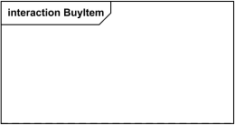 |**_Frame_** "_Interaction"_ para **Diagrama de Comunicação** _BuyItem_ |
|  | 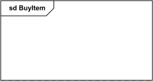 |**_Frame_** "_Sd"_ para **Diagrama de Comunicação** _BuyItem_ |
| **Lifeline**  | 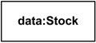 | _Lifeline_ anônimo da classe _User_ |
|  | 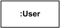  | **_Lifeline_** _"data"_ da classe _Stock_ |
|  | 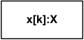  | **_Lifeline_** _"x"_ da classe _X_ selecionado com *seletor* [k] |
| **Message** |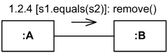 | Instância da classe **_A_ envia mensagem _remove()_ para** a instância de **_B_ se _s1_ for igual a _s2_**. |
| |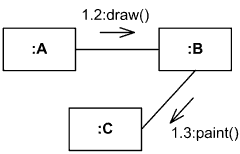 | Instância de **_A_ envia mensagem _draw()_ para** a instância de **_B_**, depois **_B_ envia _paint()_ para C**. |
| |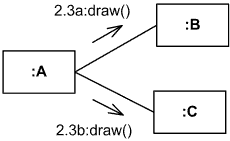 | Instância de **_A_ envia mensagem _draw()_ para** a instância de **_B_** e instância de **C**, **concomitantemente**. |
| |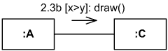 | Instância da classe **_A_ enviará mensagem _draw()_ para** a instância de **_C_ se _x_ for maior que _y_**. |
| |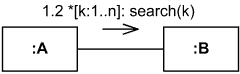 | Instância da classe **_A_ enviará mensagem _search()_ para** a instância de **_B_ _n_ vezes, uma a uma**. |
| |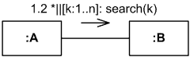 | Instância da classe **_A_ enviará _n_ mensagens _search()_ concomitantemente para** a instância de **_B_**. |

Fonte: [João Marcos Moraes de Andrade](https://github.com/JJOAOMARCOSS),  [Luiza da Silva Pugas](https://github.com/luizaxx) e [Wanjo Christopher Paraizo Escobar](https://github.com/wChrstphr), 2026.

---

## Diagrama de Comunicação

              Figura 1: Diagrama de Comunicação.

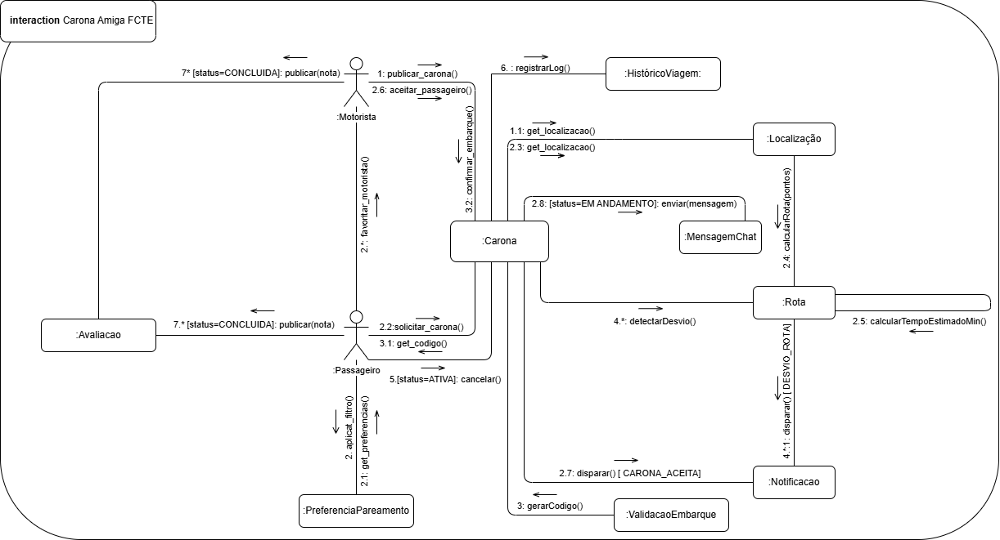

Fonte: [João Marcos Moraes de Andrade](https://github.com/JJOAOMARCOSS),  [Luiza da Silva Pugas](https://github.com/luizaxx) e [Wanjo Christopher Paraizo Escobar](https://github.com/wChrstphr), 2026.

---

## Gravação da discussão do Diagrama de Comunicação

As gravações abaixo registram a elaboração e a discussão do Diagrama de Comunicação do **Carona Amiga**.

<iframe width="1321" height="743" src="https://www.youtube.com/embed/" frameborder="0" allow="accelerometer; autoplay; clipboard-write; encrypted-media; gyroscope; picture-in-picture; web-share" referrerpolicy="strict-origin-when-cross-origin" allowfullscreen></iframe>

<a href="https://youtu.be/" target="_blank">Clique aqui para assistir no YouTube</a>

Fonte: [João Marcos Moraes de Andrade](https://github.com/JJOAOMARCOSS),  [Luiza da Silva Pugas](https://github.com/luizaxx) e [Wanjo Christopher Paraizo Escobar](https://github.com/wChrstphr), 2026.

---

## Conclusão

A elaboração do Diagrama de Comunicação do projeto **Carona Amiga** permitiu registrar, de forma objetiva, os participantes envolvidos em um cenário e as mensagens trocadas entre eles. Com isso, o artefato apoia o entendimento do comportamento do sistema, facilita a validação do fluxo com base nos requisitos e serve como referência para decisões de implementação, mantendo alinhamento com o modelo estático (Diagrama de Classes).

---

## Referências Bibliográficas

> [1] UML-DIAGRAMS. Communication Diagrams. Disponível em: https://www.uml-diagrams.org/communication-diagrams.html. Acesso em: 19 abr. 2026.
>
> [2] Material de aula. DSW-Modelagem — Comunicação (Diagrama de Comunicação/Colaboração). Material disponibilizado pela professora. Acesso em: 19 abr. 2026.
>
> [3] STÉFANE, Larissa. Diagrama de Comunicação ou Colaboração — Galáxia Conectada (Entrega 02). Disponível em: https://github.com/UnBArqDsw2025-1-Turma02/2025.1_T02_G9_GalaxiaConectada_Entrega02/blob/main/docs/Modelagem/ModelagemDinamica/DiagramaComunicacao.md. Acesso em: 19 abr. 2026.

## Histórico de Versões

| Versão | Data | Descrição | Autor(es) | Revisor(es) | Detalhes da revisão |
| :----: | :--: | --------- | ----------- | ------ | :---: |
| 1.0  | 17/04/2026 | Criação do documento | [Wanjo Christopher Paraizo Escobar](https://github.com/wChrstphr) | [Luiza da Silva Pugas](https://github.com/luizaxx) e [João Marcos Moraes de Andrade](https://github.com/JJOAOMARCOSS) | Artefato revisado |
| 1.1  | 19/04/2026 | Adicionando melhorias no documento e arrumando hyperlinks | [João Marcos Moraes de Andrade](https://github.com/JJOAOMARCOSS) | [Luiza da Silva Pugas](https://github.com/luizaxx) e [Wanjo Christopher Paraizo Escobar](https://github.com/wChrstphr) | Artefato revisado |